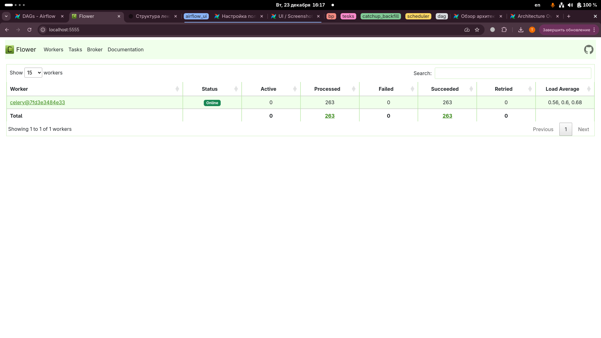
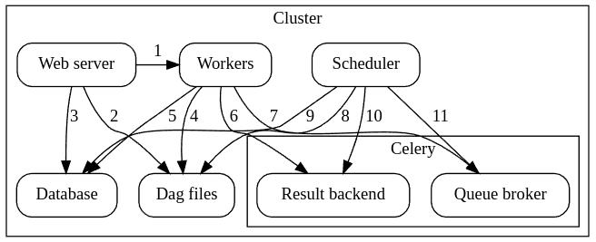

## Celery Executor

### Примечание

Начиная с версии **Airflow 2.7.0**, для использования этого исполнителя необходимо установить пакет провайдера Celery.
Это можно сделать двумя способами:

* установить пакет `apache-airflow-providers-celery>=3.3.0`
* или установить Airflow с дополнительной зависимостью celery:

```bash
pip install 'apache-airflow[celery]'
```

---

## Celery Flower

Также можно запустить **Celery Flower** — веб-интерфейс для мониторинга воркеров Celery.

## Архитектура

Airflow состоит из следующих компонентов:

* **Workers** — выполняют назначенные задачи
* **Scheduler** — отвечает за добавление задач в очередь
* **Web server** — HTTP-сервер, предоставляющий доступ к информации о статусе DAG’ов и задач
* **Database** — хранит информацию о статусе задач, DAG’ов, Variables, Connections и т. д.
* **Celery** — механизм очередей

Очередь Celery состоит из двух компонентов:

* **Broker** — хранит команды на выполнение
* **Result backend** — хранит статус завершённых команд

---

## Взаимодействие компонентов

Компоненты взаимодействуют между собой следующим образом:

1. Web server → Workers — получение логов выполнения задач
2. Web server → DAG-файлы — отображение структуры DAG
3. Web server → Database — получение статуса задач
4. Workers → DAG-файлы — чтение структуры DAG и выполнение задач
5. Workers → Database — получение и сохранение информации о соединениях, переменных и XCom
6. Workers → Result backend Celery — сохранение статуса задач
7. Workers → Broker Celery — получение команд на выполнение
8. Scheduler → DAG-файлы — чтение структуры DAG
9. Scheduler → Database — сохранение DAG Run и связанных задач
10. Scheduler → Result backend Celery — получение статуса завершённых задач
11. Scheduler → Broker Celery — отправка команд на выполнение

---

## Процесс выполнения задачи

### Процессы

Изначально запущены два процесса:

* **SchedulerProcess** — обрабатывает задачи и работает с CeleryExecutor
* **WorkerProcess** — наблюдает за очередью и ожидает появления новых задач

Также работает:

* **WorkerChildProcess** — ожидает назначения задачи

Используются две базы данных:

* **QueueBroker**
* **ResultBackend**

Во время выполнения задачи создаются дополнительные процессы:

* **LocalTaskJobProcess** — его логика описана в классе `LocalTaskJob`, он отслеживает `RawTaskProcess`
* **RawTaskProcess** — процесс с пользовательским кодом, например `execute()`

---

### Последовательность выполнения

1. `SchedulerProcess` обрабатывает задачи и, обнаружив задачу для выполнения, отправляет её в `QueueBroker`
2. `SchedulerProcess` начинает периодически запрашивать `ResultBackend` для получения статуса задачи
3. `QueueBroker`, обнаружив задачу, передаёт информацию одному из `WorkerProcess`
4. `WorkerProcess` назначает задачу одному `WorkerChildProcess`
5. `WorkerChildProcess` выполняет функции обработки задачи (`execute_command()`), создавая процесс `LocalTaskJobProcess`
6. `LocalTaskJobProcess` запускает новый процесс через `TaskRunner`
7. `RawTaskProcess` и `LocalTaskJobProcess` завершаются после выполнения
8. `WorkerChildProcess` уведомляет основной процесс `WorkerProcess` о завершении задачи и готовности к следующим
9. `WorkerProcess` сохраняет статус задачи в `ResultBackend`
10. Когда `SchedulerProcess` снова запрашивает `ResultBackend`, он получает обновлённый статус задачи

---

## Очереди (Queues)

При использовании **CeleryExecutor** можно указывать, в какие очереди отправляются задачи.

Параметр `queue` является атрибутом `BaseOperator`, поэтому **любая задача** может быть назначена в любую очередь.

Очередь по умолчанию определяется в `airflow.cfg` в секции:

```
operators -> default_queue
```

Эта очередь используется:

* если очередь явно не указана в задаче
* как очередь, которую слушают воркеры при запуске

---

## Очереди и воркеры

Воркеры могут слушать одну или несколько очередей.

При запуске воркера можно указать список очередей (через запятую, без пробелов):

```bash
airflow celery worker -q spark,quark
```

Такой воркер будет забирать **только те задачи**, которые отправлены в указанные очереди.

Это полезно, если:

* нужны специализированные воркеры по ресурсам
  (например, для очень лёгких задач, где один воркер может обрабатывать тысячи задач)
* требуется специфичное окружение
  (например, воркер должен работать внутри Spark-кластера и иметь особые права доступа и зависимости)

---