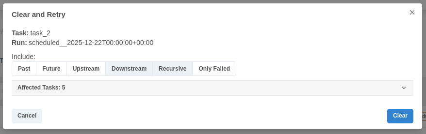

## Dag Runs

**Dag Run** — это объект, представляющий экземпляр выполнения DAG во времени. Каждый раз, когда DAG выполняется, создаётся Dag Run, и все задачи внутри него выполняются. Статус Dag Run зависит от состояний задач. Каждый Dag Run выполняется независимо от других, что означает, что у вас может быть одновременно несколько запусков одного и того же DAG.

---

## Статус Dag Run

Статус Dag Run определяется после завершения выполнения DAG. Выполнение DAG зависит от входящих в него задач и их зависимостей. Статус присваивается Dag Run в тот момент, когда все задачи находятся в одном из терминальных состояний (то есть когда невозможен переход в другое состояние), таких как `success`, `failed` или `skipped`.

Статус Dag Run определяется на основе так называемых **«листовых узлов»** (leaf nodes) или просто **«листьев»**. Листовые узлы — это задачи, у которых нет потомков.

Существует два возможных терминальных состояния Dag Run:

* **success** — если все листовые узлы находятся в состоянии `success` или `skipped`;
* **failed** — если хотя бы один из листовых узлов находится в состоянии `failed` или `upstream_failed`.


---

## Интервал данных (Data Interval)

Каждому Dag Run в Airflow назначается **интервал данных (data interval)**, который представляет временной диапазон, в рамках которого он работает. Например, для DAG’а с расписанием `@daily` каждый интервал данных начинается в полночь (00:00) и заканчивается в следующую полночь (24:00).

Как правило, Dag Run планируется после завершения соответствующего интервала данных, чтобы гарантировать, что запуск сможет собрать все данные за указанный период. Другими словами, запуск, покрывающий период данных **2020-01-01**, обычно не начинается до тех пор, пока этот день не завершится, то есть после **2020-01-02 00:00:00**.

Все даты в Airflow так или иначе связаны с концепцией интервала данных. Например, **«логическая дата»** (logical date), которая в версиях Airflow до 2.2 называлась `execution_date`, обозначает начало интервала данных, а не момент фактического выполнения DAG.

Аналогично, аргумент `start_date` для DAG и его задач указывает на ту же логическую дату и обозначает начало первого интервала данных DAG, а не момент, когда задачи начнут выполняться. Иными словами, Dag Run будет запланирован только **через один интервал после `start_date`**.

### Совет

Если cron-выражения или объект `timedelta` недостаточны для описания расписания DAG, логической даты или интервала данных, см. раздел **Timetables**. Дополнительную информацию о логической дате см. в разделах **Running Dags** и **What does execution_date mean?**

---

## Повторный запуск DAG

В некоторых случаях может понадобиться выполнить DAG повторно. Один из таких случаев — когда запланированный Dag Run завершился с ошибкой.

---

## Catchup

DAG в Airflow, определённый с `start_date`, возможно `end_date`, и расписанием, не основанным на ассетах, задаёт последовательность интервалов, которые планировщик преобразует в отдельные Dag Run и выполняет. По умолчанию Dag Run’ы, которые не были выполнены с момента последнего интервала данных, **не создаются** планировщиком при активации DAG (настройка Airflow: `scheduler.catchup_by_default=False`). Планировщик создаёт Dag Run только для самого последнего интервала.

Если установить `catchup=True` в определении DAG, планировщик создаст Dag Run для **каждого интервала данных**, который не был выполнен с момента последнего интервала (или был очищен). Эта концепция называется **Catchup**.

Если ваш DAG не рассчитан на обработку catchup (например, он ориентирован не на интервал, а на текущее время — `Now`), вам следует отключить catchup. Это является значением по умолчанию или может быть явно указано через `catchup=False` в определении DAG, если значение по умолчанию было изменено в конфигурации Airflow.

---

```python
"""
Код, используемый в учебном руководстве Airflow, расположенном по адресу:
https://github.com/apache/airflow/blob/main/airflow/example_dags/tutorial.py
"""
```

```python
from airflow.sdk import DAG
from airflow.providers.standard.operators.bash import BashOperator

import datetime
import pendulum

dag = DAG(
    "tutorial",
    default_args={
        "depends_on_past": True,
        "retries": 1,
        "retry_delay": datetime.timedelta(minutes=3),
    },
    start_date=pendulum.datetime(2015, 12, 1, tz="UTC"),
    description="Простой учебный DAG",
    schedule="@daily",
)
```


---

**Backfill**
Backfill — это процесс создания запусков (Dag Run) для прошлых дат DAG. Airflow предоставляет механизм для этого через CLI и REST API. Вы указываете DAG, дату начала и дату окончания, и Airflow создаст запуски в указанном диапазоне в соответствии с расписанием DAG.

Backfill не имеет смысла для DAG, которые не имеют расписания, основанного на времени.

**Управление повторной обработкой данных**
Существует три варианта поведения при повторной обработке:

* **none** — если запуск для этой логической даты уже существует, не создавать новый запуск, независимо от состояния.
* **failed** — если запуск существует и его состояние «failed» (неудачный), создать новый запуск для этой даты.
* **completed** — если запуск существует и его состояние «completed» (завершен) или «failed» (неудачный), создать новый запуск для этой даты.

Если последний запуск всё ещё выполняется или находится в очереди, новый запуск не создается, независимо от выбранного поведения при повторной обработке.

**Контроль одновременных запусков**
Вы можете установить параметр `max_active_runs` для backfill, чтобы контролировать, сколько запусков DAG в процессе backfill могут выполняться одновременно. Параметр `max_active_runs` для backfill применяется независимо от настройки `max_active_runs` самого DAG.

**Порядок выполнения**
Вы можете выполнять backfill в обратном порядке, т.е. сначала последние запуски. Для CLI используется опция `--run-backwards`.

**Dry run**
Dry run для backfill — это опция CLI, которая выводит даты, для которых backfill будет рассматривать создание запусков. Создадутся ли они фактически, зависит от выбранного поведения при повторной обработке и состояния любых существующих запусков в указанном диапазоне на момент фактического выполнения backfill.

**Пример**
Dry run
```bash
airflow backfill create --dag-id tutorial \
    --start-date 2015-06-01 \
    --end-date 2015-06-07 \
    --reprocessing-behavior failed \
    --max-active-runs 3 \
    --run-backwards \
    --dag-run-conf '{"my": "param"}' \
    --dry-run
```

**Пример**
Backfill можно создать как через CLI, так и через UI.

Пример команды для CLI:

```bash
airflow backfill create --dag-id tutorial \
    --start-date 2015-06-01 \
    --end-date 2015-06-07 \
    --reprocessing-behavior failed \
    --max-active-runs 3 \
    --run-backwards \
    --dag-run-conf '{"my": "param"}'
```

Эта команда создаст запуски DAG `tutorial` для всех интервалов между 1 июня 2015 и 7 июня 2015, пересоздавая только те, у которых предыдущие запуски были неудачными, с максимальным количеством одновременных запусков 3, начиная с последних интервалов, и передаст конфигурацию `{"my": "param"}` каждому запуску.

---

### Повторный запуск задач (Re-run Tasks)

Некоторые задачи могут завершиться ошибкой во время запланированного запуска.

Нажмите на упавшую задачу в представлении **Tree** или **Graph**, затем нажмите **Clear**. Исполнитель (executor) повторно запустит её.

Существует несколько вариантов, которые можно выбрать для повторного запуска:

* **Past** — все экземпляры задачи в запусках до самого последнего интервала данных DAG
* **Future** — все экземпляры задачи в запусках после самого последнего интервала данных DAG
* **Upstream** — все upstream-задачи (предшествующие задачи) в текущем DAG
* **Downstream** — все downstream-задачи (последующие задачи) в текущем DAG
* **Recursive** — все задачи в дочерних и родительских DAG
* **Failed** — только упавшие задачи в самом последнем запуске DAG

Вы также можете очистить задачу через CLI, используя команду:

```bash
airflow tasks clear dag_id \
    --task-regex task_regex \
    --start-date START_DATE \
    --end-date END_DATE
```

Для указанного `dag_id` и временного интервала команда очищает все экземпляры задач, соответствующие заданному регулярному выражению. Для получения дополнительных параметров вы можете посмотреть справку команды очистки:

```bash
airflow tasks clear --help
```

---

Если нужно — могу продолжить перевод следующих разделов **в том же стиле и уровне точности**, включая *Task Instance History*, *External Triggers*, *Passing Parameters*, *Wait for a Dag Run* и т.д.

[Dag run](https://airflow.apache.org/docs/apache-airflow/stable/core-concepts/dag-run.html#ui)

[Backfill](https://airflow.apache.org/docs/apache-airflow/stable/core-concepts/backfill.html)